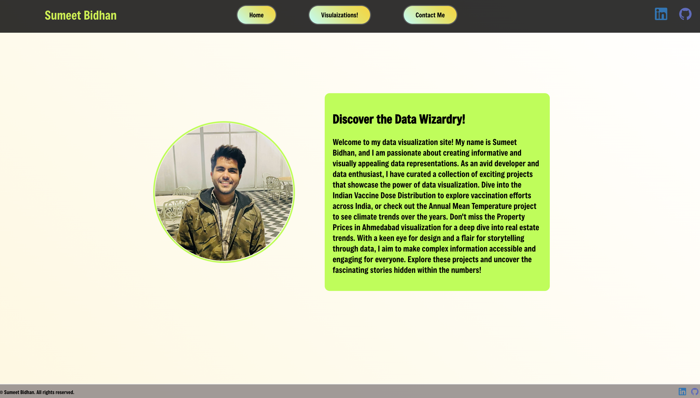
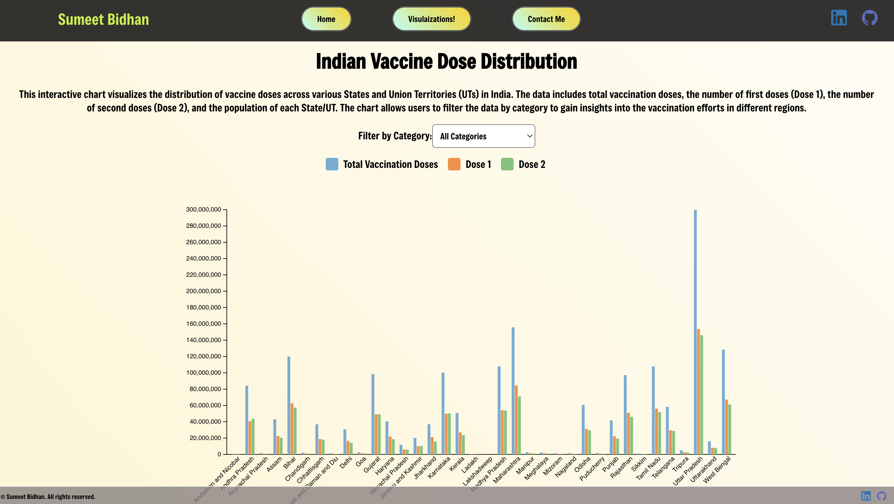
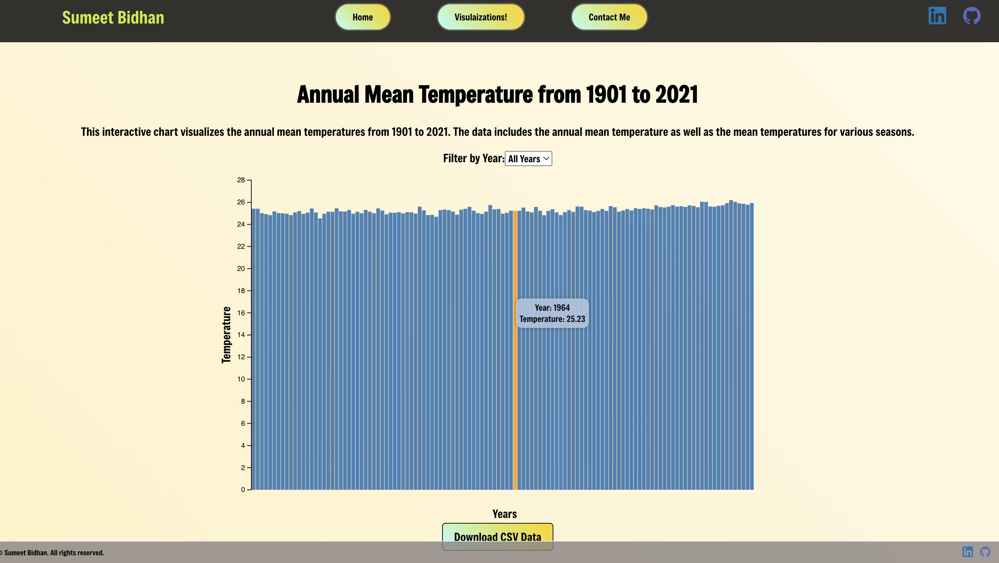
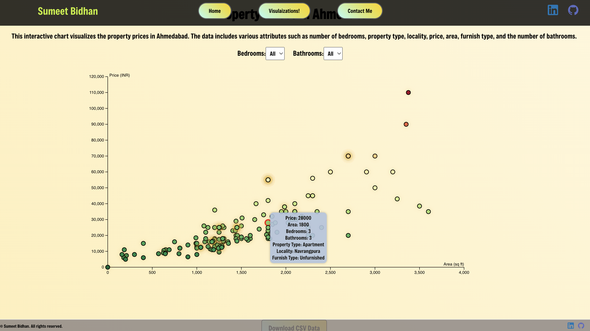

# Data Visualization Site

A React-based data visualization site that displays various datasets using interactive charts and graphs. This project includes visualizations for vaccine dose distribution, annual mean temperatures, and property prices in Ahmedabad.

## Table of Contents
- [Project Overview](#project-overview)
- [Features](#features)
- [Screenshots](#screenshots)
- [Getting Started](#getting-started)
- [Running the Project](#running-the-project)
- [Dependencies](#dependencies)
- [Contributing](#contributing)
- [License](#license)

## Project Overview

This project is a web application built with React and D3.js for visualizing various datasets. The application includes the following visualizations:
- Indian Vaccine Dose Distribution
- Annual Mean Temperature from 1901 to 2021
- Property Prices in Ahmedabad

## Features
- Interactive charts with filtering options
- Data downloading as CSV files
- Responsive design

## Screenshots

### Home Page


### Indian Vaccine Dose Distribution


### Annual Mean Temperature


### Property Prices in Ahmedabad


## Getting Started

### Prerequisites
- Node.js (version 12 or later)
- npm (version 6 or later)

### Installation
1. Clone the repository:
   ```bash
   git clone https://github.com/sumeetbidhan/data-visualization-site.git
Navigate to the project directory:
bash
Copy code
cd data-visualization-site
Install the dependencies:
bash
Copy code
npm install
Running the Project
To run the project locally, use the following command:

bash
Copy code
npm start
This will start the development server and open the application in your default web browser. The server will automatically reload if you make changes to the source code.

Dependencies
This project relies on the following major dependencies:

React: A JavaScript library for building user interfaces
D3.js: A JavaScript library for producing dynamic, interactive data visualizations
react-router-dom: A library for routing in React applications
For a complete list of dependencies, refer to the package.json file.

Contributing
Contributions are welcome! Please follow these steps to contribute:

Fork the repository.
Create a new branch (git checkout -b feature-branch).
Make your changes and commit them (git commit -m 'Add some feature').
Push to the branch (git push origin feature-branch).
Open a pull request.
License
This project is licensed under the MIT License. See the LICENSE file for details.

